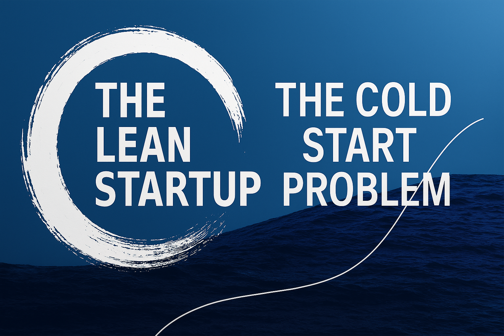

# The Cold Start Problem and MVN
# 推薦《冷啟動問題》一書及最小可行網路 MVN 概念
**我預測這本書會與《精實創業》一書齊名**

[The Cold Start Problem: Using Network Effects to Scale Your Product](https://madhavajay.com/the-cold-start-problem-using-network-effects-to-scale-your-product/)

看到這篇介紹 [The Cold Start Problem: Using Network Effects to Scale Your Product](https://www.amazon.com.au/Cold-Start-Problem-business-launch-pad/dp/1847942784) 這本書，裡面提到的 MVN (Minimum Viable Network)，讓我想到 [精實創業](https://www.books.com.tw/products/0010768288) ([The Lean Startup](https://en.wikipedia.org/wiki/The_Lean_Startup)) 提出的 MVP (Minimum Viable Product)。

書中強調的網路效應 (Network Effects) 我 2022 年看過的一篇 [History's Network Effects](https://unchartedterritories.tomaspueyo.com/p/history-network-effects) 有由最基本的原理介紹歷史的網路效應。後來還有有關科技業的 [Platforms and Aggregators](https://unchartedterritories.tomaspueyo.com/p/platforms-and-aggregators)，以及一個實例 [The Future of Substack](https://unchartedterritories.tomaspueyo.com/p/the-future-of-substack)，都非常值得一讀。以上三篇文章都出自 [Uncharted Territories | Tomas Pueyo](https://unchartedterritories.tomaspueyo.com/)，是我唯一付費訂閱的文章網站，裡面所有文章 (有免費有付費) 都值得推薦!

我預測 The Cold Start Problem 一書會成為繼 The Lean Startup 之後同樣著名的暢銷書，MVN 相當於 MVP，會成為啟動一項業務，大家必要朗朗上口的秘訣。我個人沒有買此書，只有看上文書摘，更沒有業配。
 
我認為，若有面對客戶的業務推動很辛苦，這裡面的 網路效應 問題值得用力關注!

平時我不寫摘要的，希望大家親自閱讀 (我都讀翻譯)，直接吸收第一手資訊 (或者你要點進去後再請 AI 摘要)。不過這一篇書摘覺得太重要了，請出 AI 再來幫忙寫更濃縮的摘要:

---
1.  **核心矛盾（Paradox）**
    要打造大規模的網路效應，必須先從「最小可行網路」（Atomic Network）起步，並利用該小型網路的成功，逐步撬動下一個更大的網路。
2.  **原子網路（Atomic Network）定義**
    能自行運作、為其成員創造價值，並保持穩定、自我增長的最小用戶集合。關鍵在於用戶之間的互動能持續產生價值迴圈。
3.  **困難端（Hard Side）重要性**
    困難端指那些為網路核心價值提供大量貢獻的少數用戶（如 Uber 司機、Airbnb 房東、YouTube 創作者）。必須優先鎖定並解決他們的痛點，才能吸引大量「容易端」（消費者／觀眾）。
4.  **冷啟動（0→1）階段策略**
    -   **解決難題（Solving a Hard Problem）**：打造真正能解決痛點的產品。
    -   **單人工具／吸引工具（Single-Player ／ Come for the Tool）**：先做對個人有用的工具，再引導他們進入網路互動。
    -   **原子網路（Atomic Network）**：聚焦於特定社群或場景，例如校園、垂直市場。
    -   **殺手級產品（Killer Product）**：功能易用、體驗卓越，讓用戶自發口碑傳播。
    -   **Flintstoning（偽造首批內容）**：手動或「假裝」創造前期內容，讓平台看起來已有活躍度。
    -   **Magic Moments（魔力時刻）**：精心設計首次使用的驚喜體驗，加速用戶「上癮」。
5.  **常見反模式及對策**
    -   迴避過度追求大規模用戶、忽視網路密度、只拉「容易端」、或依賴持續補貼。
    -   建議：先深耕小眾、提升互動質量、精準補貼、及早佈建內容策劃與社群管理機制。
6.  **溫啟動（1→N）成長階段重點**
    -   **裂變效應（Acquisition Effect）**：邀請制、邀請獎勵、社交傳播。
    -   **參與效應（Engagement Effect）**：優化互動、推播機制、用戶留存。
    -   **經濟效應（Economic Effect）**：貨幣化與商業模式優化。
    -   同時防範「飽和天花板」：建立內容策展、品質控管與競爭壁壘。
7.  **成功案例對照**
    Uber、Airbnb、Tinder、Slack、Zoom、Instagram、LinkedIn、PayPal、Dropbox、YouTube、Twitch、Clubhouse、eBay、Craigslist、Microsoft 等，分別展示如何在冷啟動與擴張階段，透過上述策略突破初期瓶頸並持續成長。
8.  **實作建議**
    -   **數據分析**：追蹤用戶行為、互動頻率與留存率。
    -   **用戶調研**：與早期用戶深度訪談，發掘痛點與魔力時刻。
    -   **低摩擦價值行為**：優化新手任務，引導產生關鍵互動。
    -   **精準社群經營**：從小眾社群切入，逐步拓展。

---

總結來說，要克服「冷啟動問題」，必須先在一個小型、可自持的原子網路中打下基礎，確保困難端的活躍與價值持續，然後再透過一系列精準策略，逐步撬動更大範圍的網路效應。