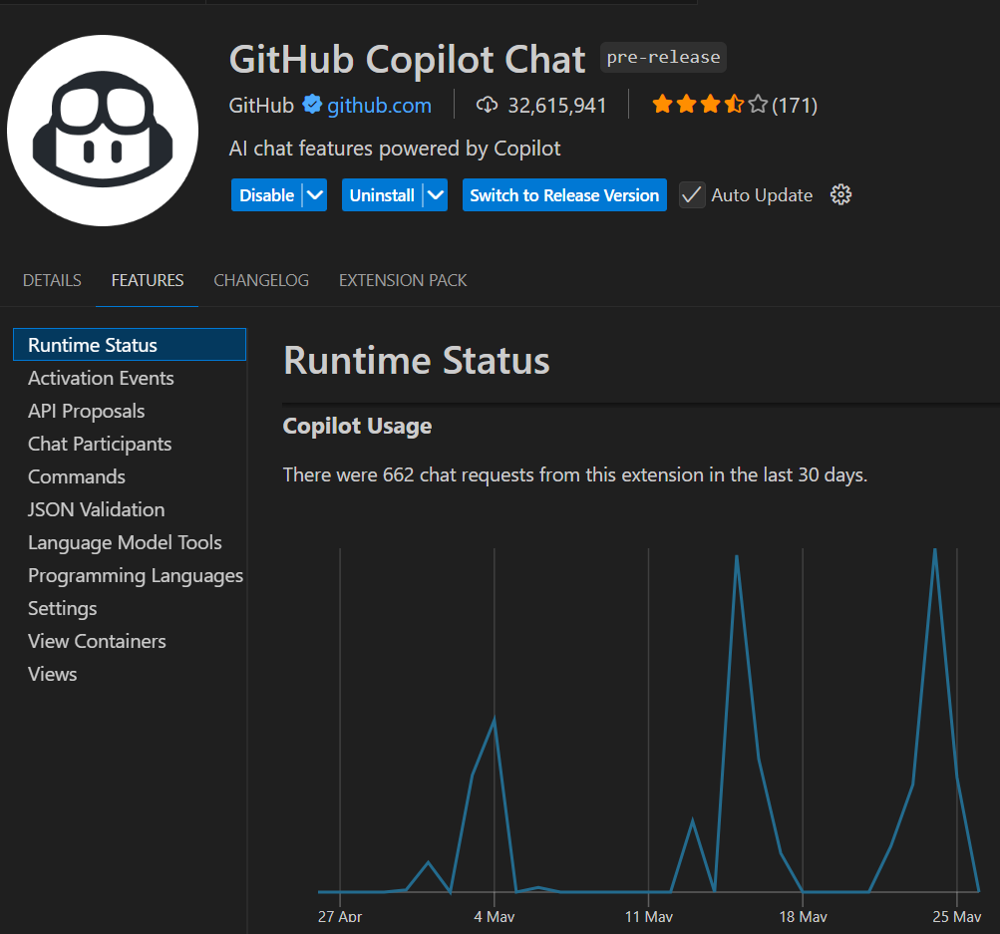

# 20250526 GitHub Copilot Model Selection Strategy
# GitHub Copilot 模型選擇策略

Agent/Edit 用量很兇要小心

## 6/4 之後點數要求
[Plans for GitHub Copilot](https://docs.github.com/en/copilot/about-github-copilot/plans-for-github-copilot#comparing-copilot-plans)

2025/6/4 之後，GitHub Copilot 即將計點數限流，一般付費的 Copilot Pro/Business 每月 300 點，超過的話還得付費加購。因此接下來得費心考慮使用什麼模型。

## 模型選擇

[About premium requests](https://docs.github.com/en/copilot/managing-copilot/monitoring-usage-and-entitlements/about-premium-requests)

> | Model | Premium requests |
> | --- |  --- |
> | Base model (currently GPT-4.1) | 0 > (paid users), 1 (Copilot Free) |
> | Premium GPT-4.1 | 1 |
> | GPT-4o | 1 |
> | GPT-4.5 | 50 |
> | Claude 3.5 Sonnet | 1 |
> | Claude 3.7 Sonnet | 1 |
> | Claude 3.7 Sonnet Thinking | 1.25 |
> | Claude Sonnet 4 | 1 |
> | Claude Opus 4 | 10 |
> | Gemini 2.0 Flash | 0.25 |
> | Gemini 2.5 Pro | 1 |
> | o1 | 10 |
> | o3 | 5 |
> | o3-mini | 0.33 |
> | o4-mini | 0.33 |

依此表分析:

- 超貴而能力不怎麼樣的 GPT-4.5 (50) 不應該使用
- 比 GPT-4.1 更笨的 GPT-4o (1) 不應該使用
- Premium GPT-4.1 (1) 還不知是什麼 ([What is Premium GPT-4.1 model?](https://github.com/orgs/community/discussions/159608))
- 想要快，用量不多不怕整月超過 300 點可選 Gemini 2.0 Flash (0.25)
- 複雜問題想要推理可試便宜的 o4-mini (0.33)/Claude 3.7 Sonnet Thinking (1)，而 o1 (10)/o3 (5) 較不划算，更笨的 o3-mini (0.33) 也不應使用
- 有 Claude Sonnet 4 (1) 可用，那更笨的 Claude 3.5/3.7 Sonnet (1) 也不應使用
- 與其使用點數多的 o1 (10)/o3 (5)，不如以點數少的 o3-mini (0.33)/o4-mini (0.33) 多跑幾次得到不同結果

目前提供的 Claude Sonnet/Opus 4 應該不是推理模式? 
[Introducing Claude 4 \ Anthropic](https://www.anthropic.com/news/claude-4)
> Claude Opus 4 and Sonnet 4 are hybrid models offering two modes: near-instant responses and extended thinking for deeper reasoning.
 
另在 6/4 之前，還不是依上述每月用量計算。目前仍有限流，但似乎是隔天就恢復?

雖然目前還沒有，但未來版本應該會顯示目前使用點數，以及每月計數重設日期?

目前在 VSCode - Extensions - GitHub Copilot Chat - FEATURES - Runtime Status 有 30 天內使用次數的計算，但不是點數，也不知該次數是否與點數計算是一致的。

如我上圖，30 天已用 662 次!?

## 模型選擇策略

綜上所述，針對付費用戶，我建議的模型選擇策略如下:

- 6/4 之後，預設使用 GPT-4.1，除非做不出來，再考慮使用
  - 一般性問題使用 Claude Sonnet 4 (1)/Gemini 2.5 Pro (1)
  - 複雜需推理問題使用  o4-mini (0.33)/Claude 3.7 Sonnet Thinking (1.25)
  - 若一時沒做出來，寧可 多跑幾次/換便宜模型/改提示，也不要用較多點數模型
- 而 6/4 之前，多使用 GPT-4.1 之外的其他模型，了解以上建議之幾個模型的優缺點

當然如果你用量少，不怕每月 300 點用完，是可以不理會以上的建議順序。

## 怎樣算一次呼叫?

Agent/Edit 模式，是否發一個提示都只算一次用量，還是裡面的多次階段執行都各算一次?

目前觀察 GitHub Copilot Agent 選擇 Claude Sonnet 4 用到被限制 rate limited，比對 OUTPUT - GitHub Copilot Chat 認為可以找到一對一輸出，一次提示的每一筆輸出都是同一個 `requestId`，也都有標示 \[tool_calls\]。

再搭配輸入 `/list` 得到的:

> Available tools:
> 
> - create_and_run_task
> - create_directory
> - create_file
> - create_new_jupyter_notebook
> - create_new_workspace
> - edit_notebook_file
> - fetch_webpage
> - file_search
> - test_search
> - grep_search
> - get_changed_files
> - get_errors
> - get_project_setup_info
> - get_search_view_results
> - get_terminal_last_command
> - get_terminal_output
> - get_terminal_selection
> - get_vscode_api
> - github_repo
> - insert_edit_into_file
> - install_extension
> - list_code_usages
> - list_dir
> - open_simple_browser
> - read_file
> - read_notebook_cell_output
> - replace_string_in_file
> - run_in_terminal
> - run_notebook_cell
> - semantic_search
> - test_failure
> - think
> - vscode_installExtensions
> - vscode_searchExtensions_internal
> - bb7_playwright_assert_response
> - bb7_playwright_click
> - bb7_playwright_close
> - bb7_playwright_console_logs
> - bb7_playwright_custom_user_agent
> - bb7_playwright_delete
> - bb7_playwright_evaluate
> - bb7_playwright_expect_response
> - bb7_playwright_fill
> - bb7_playwright_get
> - bb7_playwright_hover
> - bb7_playwright_iframe_click
> - bb7_playwright_navigate
> - bb7_playwright_patch
> - bb7_playwright_post
> - bb7_playwright_put
> - bb7_playwright_screenshot
> - bb7_playwright_select
> - vscode-websearchforcopilot_webSearch

認為四筆依序是:

- replace_string_in_file
- run_in_terminal
- read_file
- replace_string_in_file

由於並不是一開始被拒絕而是中途被限制，我目前認為應該是 Agent 模式中每一次 \[tool_calls\] 都計為一次呼叫。看圖可以簡單理解就是每一串文字配方框功能，就是一次呼叫。另觀察 Edit 模式也是有類似的 \[tool_calls\]，看來也同樣有多次呼叫的現象。

## 結論

- 6/4 前多熟悉 Claude Sonnet 4 (1)/Gemini 2.5 Pro (1)/o4-mini (0.33)/Claude 3.7 Sonnet Thinking (1.25)
- 6/4 後預設使用 GPT-4.1 (0)，做不出來可改提示，或者換用上述模型
- 其他模型基本上不建議使用
- Agent/Edit 用量很兇要小心
