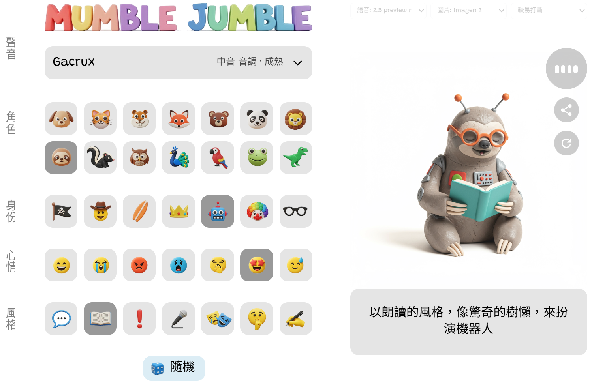

# Google AI Studio Mumble Jumble zht
# Google AI Studio - Mumble Jumble 繁體中文 開發體驗

**GitHub Copilot + Claude Sonnet 4 還是勝過 Gemini**

線上展示: [Google AI Studio - Mumble Jumble 繁體中文](https://aistudio.google.com/app/prompts?state=%7B%22ids%22:%5B%221PLz1ymGabVV1oZjFvDbodY7QiGRPTNpF%22%5D,%22action%22:%22open%22,%22userId%22:%22115817363595740447839%22,%22resourceKeys%22:%7B%7D%7D&usp=sharing)

本文分享以 GitHub Copilot + Claude Sonnet 4 和 Google Gemini 將 Mumble Jumble 專案中文化的實戰心得。這次實測中，Copilot + Claude 開發還是勝過 Gemini。

## Gemini 的體驗

聽保哥的 [使用 Google AI Studio 與 Gemini 進行氛圍程式設計](https://www.facebook.com/will.fans/videos/2991473334384787) 直播介紹，感覺 Google AI Studio 蠻好玩的。裡面介紹到一個範例 [Mumble Jumble](https://aistudio.google.com/apps/bundled/mumble_jumble) 很有趣，選角色風格後，它會 AI 繪圖並以該角色對話，但全都是英文的。(你也可以玩保哥分享的 [Google Cloud 版本](https://mumble-jumble-327655012190.us-west1.run.app/))

我想改為中文化，在 Google AI Studio 上卻怎麼改都是壞的，就像保哥直播中直接翻車一樣，體驗不佳。雖然保哥說他先前試幾乎都直接成功，但我也是一樣，做不出來。不清楚它背後是 Gemini 哪一種模型。

## GitHub Copilot + Claude Sonnet 4 的體驗

還好可以整個專案 ZIP 下載，我用 VSCode + GitHub Copilot + Claude Sonnet 4 + Agent mode，一開始還無法本機開發 (開出來只有空白畫面)，還好 Copilot 提供了可行方法，之後 Agent 翻譯看起來也挺辛苦的，一步一步翻了蠻久的，進行的都還順利。只有有關語音提示的部份，它也要翻譯但因內容太長，程式被破壞掉，它還企圖退回 git 上一步，我就放棄了，手改恢復程式正常。之後放棄翻譯語音提示，只要它保持原有的英文提示，只增加要求使用中文台灣口音就好。

我的原始碼在 [ChrisTorng/mumble-jumble-zht](https://github.com/ChrisTorng/mumble-jumble-zht)，你也可以在 [Build | Google AI Studio - Mumble Jumble 繁體中文](https://aistudio.google.com/app/apps/drive/1PLz1ymGabVV1oZjFvDbodY7QiGRPTNpF?showPreview=true&showCode=true&showAssistant=true) 上直接用 Gemini 修改它。我則是下載後在本機開發，完成後再上傳到 Google AI Studio 以進行分享。

所有 GitHub Copilot 開發過程都在 [mumble-jumble-zht/prompts](https://github.com/ChrisTorng/mumble-jumble-zht/tree/main/prompts) 資料夾中。

## Agent mode 點數計算

另趁 2025/7/1 重設 GitHub Copilot 點數之前的這幾天，多用了 Claude Sonnet 4 + Agent mode。雖然 Agent mode 運作了非常多輪，但發現耗用點數不多，因此目前推測，可能是每送出一個 user prompt 計一次，而不是像先前猜測的，每個工具調用都計一次。因此[先前文章](https://christorng.substack.com/p/github-copilot-model-selection-strategy)中說的「Agent/Edit 用量很兇要小心」可能是錯的。這也代表，如果用非零點模型，可以儘量用 Agent mode 來開發，讓它一次完成多一些事。