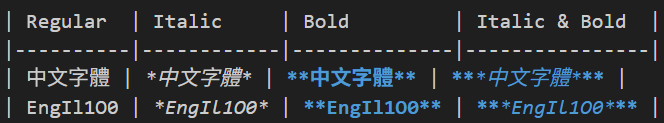
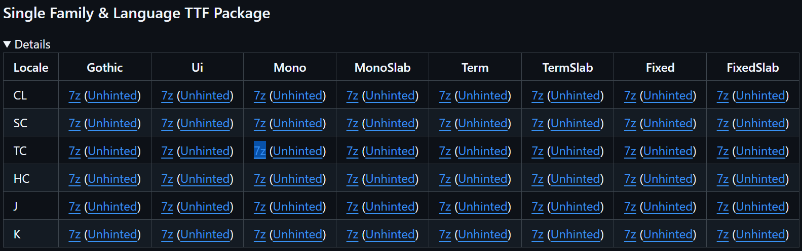
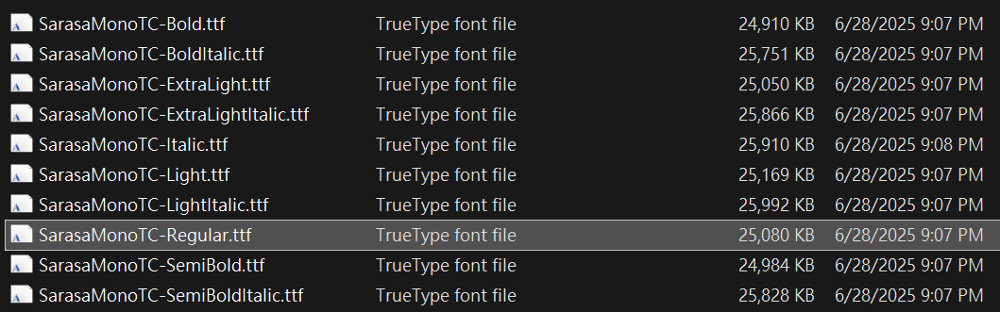
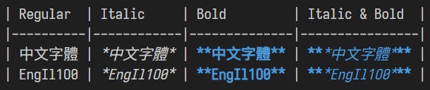
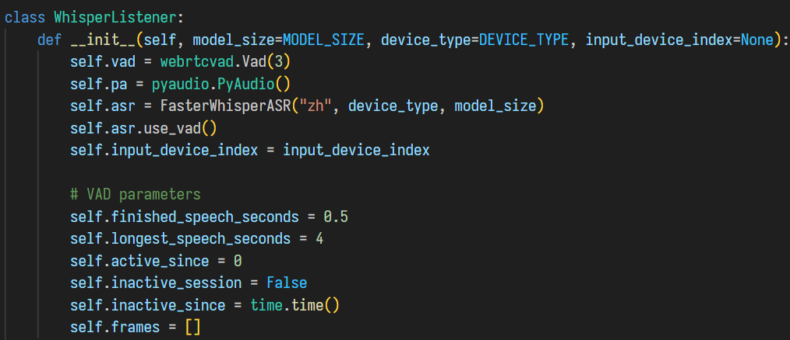

# 20250716 VSCode monospaced font
# VSCode 等距寬度字型

**感謝黑大解法，我再加以優化**

因為在 [黑暗執行緒](https://blog.darkthread.net/) 中看到 [就是要 Markdown - SQL Schema 匯出 Markdown 表格轉 PDF](https://blog.darkthread.net/blog/sql-schema-to-markdown-table/) 文章，裡面有張 VSCode Markdown 表格圖片，很明顯表格線沒有對齊。

這裡我做一個很簡單的表格範例:
| Regular  | Italic     | Bold         | Italic & Bold  |
|----------|------------|--------------|----------------|
| 中文字體 | *中文字體* | **中文字體** | ***中文字體*** |
| EngIl1O0 | *EngIl1O0* | **EngIl1O0** | ***EngIl1O0*** |

(又發現新問題，編輯器中僅斜體或粗體可以正確預覽顯示，斜體加粗體卻不行)

這個問題我先前研究過，因為中英文寬度不一樣 (兩個英數字母略寬於一個中文字)，導致 Markdown 表格線無法對齊。在寫其他的程式碼檔，可能比較不會注意到這個問題，而在 Markdown 表格中，這個問題就很明顯。只要單行內中文字數越多，與英數行表格線的差距就越大。

我先前嘗試過一些方法，都沒有奏效。上網找解法，都要安裝些奇奇怪怪的字型，不太想亂試。

[留言請教黑大](https://blog.darkthread.net/blog/sql-schema-to-markdown-table/#e16591c3-fce6-4516-8e1c-9bc90e0c3b9e)後，一天內就有了新文章 [解決 VSCode 編譯視窗中英文字寬不一無法對齊問題](https://blog.darkthread.net/blog/sarasa-mono-font-4-vscode/)。但我覺得自己還能針對黑大的結論再加以改進，因此寫了這篇文章。

黑大
> 選擇下載 SuperTTC (7z 133MB，ttc 檔 785MB) 裡面包含有所有 Sarasa 系列字型，按【安裝】一次全裝

我不想安裝 785MB 的一大堆字型，最後在目前最新 Release [Sarasa Gothic, Version 1.0.31](https://github.com/be5invis/Sarasa-Gothic/releases/tag/v1.0.31) 中，選擇了 [Single Family & Language TTF Package - TC - Mono - 7z](https://github.com/be5invis/Sarasa-Gothic/releases/download/v1.0.31/SarasaMonoTC-TTF-1.v0.31.7z):

下載 7z 65MB，解壓後 10 個檔共 248MB。我僅安裝 `SarasaMonoTC-Regular.ttf` 一個字型 25MB:

由黑大的安裝 785MB 一堆字型，我只安裝 25MB 一個字型，減少了 30 倍。

在 VSCode 中按 `Ctrl+,` 開啟 Settings，輸入 `font` 找到 `Editor: Font Family`，在最前面加入 `'Sarasa Mono TC', `，然後還要重開 VSCode，最後看到完美的表格:

這個字體的繁體中文我沒有注意到與原本預設的差別，而英數比一般為窄，我想就是為了與較窄的中文字寬度對齊所必要的犧牲。我會試著適應在 VSCode 中使用這個字型:
