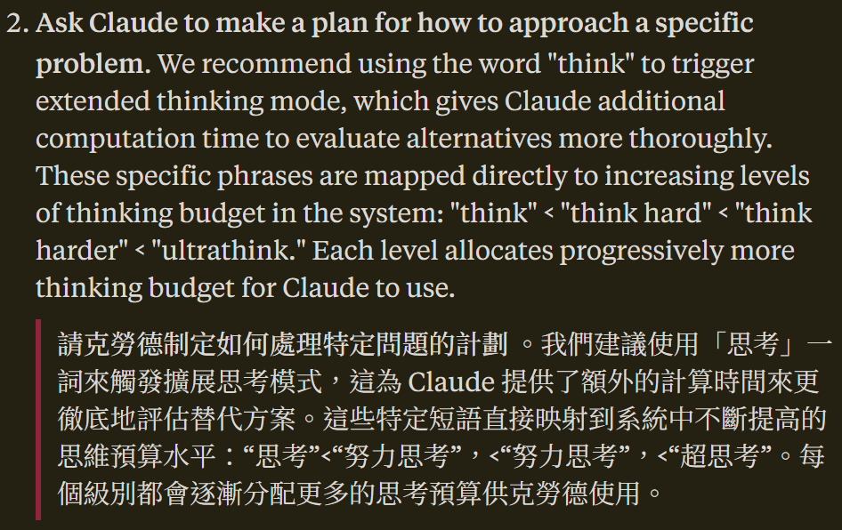

# 20250719 Claude Code keyword `ultrathink` analysis
# Claude Code 關鍵字「ultrathink / 深思」分析

**"`ultrathink`" 關鍵字，早就不是秘密**

Anthropic 官網在 2025/4/18 [Claude Code Best Practices](https://www.anthropic.com/engineering/claude-code-best-practices) 一文中，就已公開 [Claude Code](https://www.anthropic.com/claude-code) (於 [2025/2/25 公開](https://www.anthropic.com/news/claude-3-7-sonnet)) 之 `ultrathink` 的「功能」(所以這早就不是秘密):

官網文章說 `think` < `think hard` < `think harder` < `ultrathink`。

而隔天的 [Claude Code: Best practices for agentic coding](https://simonwillison.net/2025/Apr/19/claude-code-best-practices/) 中，已有「查閱」Claude Code 程式碼，確認這「功能」的實作，是在 prompt 中若發現有 `think` 關鍵字就提供 4000 tokens，`think hard` 有 10000 tokens，不過 `think harder` 與 `ultrathink` 皆提供一樣最高的 31999 tokens，與官網說的不同。因此這技巧單純是以關鍵字改變可用 tokens 數上限而獲得的。

最近的 [shareAI-lab/analysis_claude_code](https://github.com/shareAI-lab/analysis_claude_code) 有提供反混淆 Claude Code 後所得的原始碼。由 [chunks.99.mjs 2492-2765 行](https://github.com/shareAI-lab/analysis_claude_code/blob/main/claude_code_v_1.0.33/stage1_analysis_workspace/chunks/chunks.99.mjs#L2492-L2765) 可完整看到解出來的完整邏輯，一樣是 31999/10000/4000。中文可用「多想一会/深思/仔细思考」觸發 31999，沒看到簡繁轉換，因此對我們繁體中文用「深思」最容易。而 NONE 對應 0 還看不太懂，意思是沒有 thinking 模式嗎?

目前的結論:

- `think`/`想`/`思考`: 4000
- `think hard`/`多想想`/`好好想`: 10000
- `think harder`/`ultrathink`/`深思`: 31999

另在 Claude Code [2025/2/25 公開](https://www.anthropic.com/news/claude-3-7-sonnet)的當天，[Yuyz0112/claude-code-reverse](https://github.com/Yuyz0112/claude-code-reverse) 就有 Claude Code 的反混淆分析 (當時當然還沒有很完整)，這篇還有說明他如何用 LLM 做反混淆分析的方法。