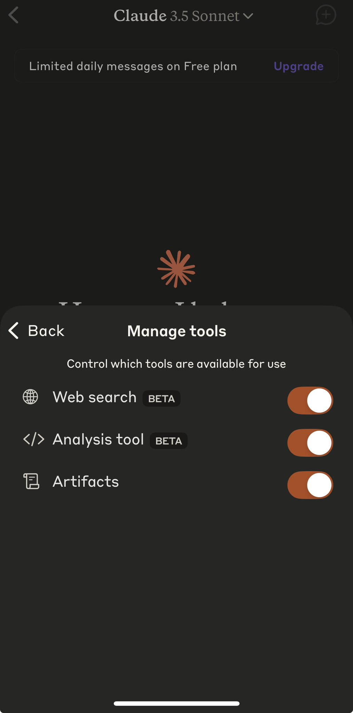
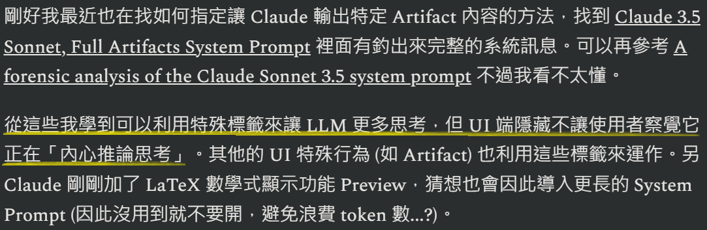

# Didn't Claude already have reasoning functionality for have a year?
# Claude 不是早有推理功能半年了嗎?
不知為何 Anthrpic 當初沒有宣揚

[CHOI on X: "Claude Extended Thinking!](https://x.com/arrakis_ai/status/1892141483941347627?mx=2)

[Anthropic 的 Claude 4 即将发布前新功能曝光：带有 Thinking 模式，且可以看到推理过程](https://www.datalearner.com/blog/1051739628203384)

去年八月 [Claude 的能力探究](https://christorng.substack.com/p/claude)中，我就發了 Claude 就有 \<antThinking\> 的隱藏訊息，我認為這已經是推理模式了。當時我就寫下:

> 從這些我學到可以利用特殊標籤來讓 LLM 更多思考，但 UI 端隱藏不讓使用者察覺它正在「內心推論思考」。

Claude 3.5 Sonnet 從一開始就有這個能力，當初就被開發者認為比 OpenAI 最強模型還要好，我也跳槽了好幾個月。

不曉得為何 Anthropic 當初沒有提出推理這個方向。因為這個 \<antThinking\> 一直就是隱藏的，推測 Anthropic 不想大張旗鼓宣傳，讓大家快速跟進吧。

只是因為原本版本沒得選擇要長還是要快，都是限制較短的長度。現在即將推出的 Extended Thinking，我認為是可以允許更長的推理鏈，也終於可以選擇顯示推理過程。

直到現在，即使 GitHub Copilot 有 Gemini 2.0 Flush (Preview)、o1 (Preview) 及 o3-mini (Preview) 可選，我還是最愛用 Claude 3.5 Sonnet (Preview)，若遇到卡住問題才換 o3-mini (Preview)。Gemini 2.0 Flush (Preview) 還是不太好用。